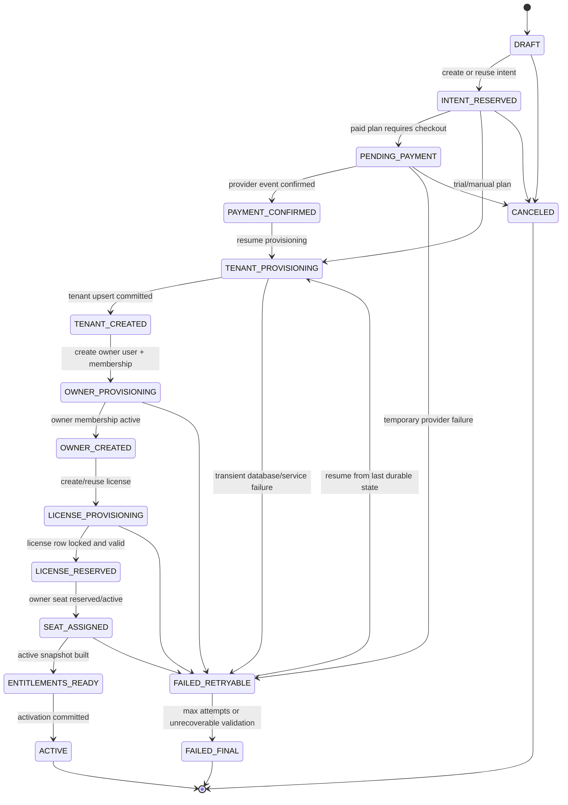

# ClarioWatheeq Onboarding + License Race — Definitive Fix Design, Updated Version

> **Status:** SaaS-ready product and implementation design.
>
> **Important source note:** The requested source path, `/Users/mac/clario360/docs/ClarioWatheeq/Onboarding_License_Race_Definitive_Fix_Design.md`, is a local macOS path and was not mounted in this workspace. This updated version is therefore a best-effort, implementation-ready rewrite inferred from the filename and the existing Watheeq/Lex SaaS context, not a line-preserving transformation of the inaccessible source file.
>
> **Purpose:** Make tenant onboarding, license activation, seat assignment, and entitlement/session hydration deterministic under retries, duplicate submissions, webhook reordering, concurrent browser tabs, background workers, and multi-node deployments.
>
> **Design stance:** Licensing gates whether a tenant/user can enter the product suite. RBAC gates what that user can do inside the suite. The two layers must be resolved together in the session, but they must remain separate security concepts.

---

## 1. Executive Decision

ClarioWatheeq should move to an **idempotent onboarding-intent model** with a strict license activation state machine, database-backed concurrency controls, and versioned entitlement snapshots.

The target design is:

1. **One onboarding intent per unique tenant/product/owner/license request.** Duplicate submissions must resume the same intent, not create a second tenant, subscription, license, owner, or seat.
2. **License activation is transactional and resumable.** A crash after tenant creation must not restart onboarding from scratch.
3. **Seat assignment is protected by row-level locking and unique active-seat indexes.** The database, not the UI, must prevent over-assignment.
4. **Entitlements are produced as versioned snapshots after license activation.** Session hydration must read a stable entitlement view, not a partially provisioned license row.
5. **External side effects use an outbox.** Welcome emails, CRM sync, webhooks, analytics, and notifications must fire only after the authoritative transaction commits.
6. **The frontend must treat `PROVISIONING`, `PENDING_PAYMENT`, and `FAILED_RETRYABLE` as first-class states.** Users should see a resumable setup screen, not a broken dashboard or misleading 403.
7. **Payment/webhook ordering must not matter.** Webhooks can arrive before, during, or after browser onboarding and still converge to the same active license.
8. **Every transition must be auditable.** License changes are commercial/security events and must be traceable.

The core product invariant is simple:

> A user may enter a licensed suite only when the tenant has an active license for that suite, the user has an active seat or included access grant, and the session has hydrated an active entitlement snapshot.

---

## 2. Problem Definition

The license race exists when onboarding and licensing are not treated as one deterministic workflow. Common triggers include:

| Race source | Typical symptom | Required fix |
|---|---|---|
| User double-clicks submit or refreshes checkout callback | Duplicate onboarding rows, duplicate tenants, duplicate welcome emails | Idempotency key + onboarding-intent fingerprint |
| Multiple tabs complete onboarding | Same owner gets multiple memberships or seats | Unique membership/seat indexes + resume existing intent |
| Payment webhook arrives before tenant creation finishes | Paid subscription exists but no tenant/license binding | Pending payment-event inbox bound to onboarding intent |
| Tenant is created, then license activation fails | User logs in but has no usable entitlement | Resumable state machine and status screen |
| First login happens before entitlements are built | Dashboard loads with missing modules or incorrect 403 | Session must expose onboarding/license state |
| Background worker retries after partial success | Duplicate side effects or plan transitions | Outbox idempotency + transition guards |
| Two users/admins assign the last available seat | Seat count exceeds limit | `SELECT ... FOR UPDATE` on license row + active-seat unique index |
| Plan upgrade/downgrade races with onboarding | Wrong entitlement set becomes active | Subscription transition versioning |
| Cache remains stale after activation | User remains blocked after license is active | Versioned entitlement snapshots + cache invalidation event |

The current class of issue should not be solved by adding sleeps, optimistic UI delays, or frontend-only guards. The fix belongs at the workflow, database, idempotency, and entitlement-resolution layers.

---

## 3. Non-Negotiable Invariants

### 3.1 Tenant and onboarding invariants

1. A normalized tenant slug can map to only one active tenant.
2. A normalized owner email can have only one active owner membership per tenant.
3. An onboarding intent must be resumable from its last durable state.
4. Retrying the same onboarding request must return the same intent and current status.
5. A failed retryable intent must never require manual database cleanup for ordinary transient errors.

### 3.2 License invariants

1. A tenant can have only one active or provisioning license per product code unless the product explicitly supports parallel licenses.
2. A license cannot become `ACTIVE` until its tenant exists.
3. A user cannot consume a seat unless the license is active or in an explicitly allowed provisioning grace state.
4. Active seat assignments cannot exceed `seat_limit`.
5. License status changes must be monotonic unless performed through an explicit transition, such as upgrade, downgrade, cancellation, or reactivation.

### 3.3 Entitlement invariants

1. Entitlements are derived from license state, plan configuration, feature flags, and tenant overrides.
2. The frontend should receive a resolved entitlement snapshot, not recompute licensing rules itself.
3. RBAC permissions do not create product entitlement. A user with `lex:*` must still be blocked if the tenant has no active Watheeq/Lex license.
4. Entitlement snapshots are immutable once activated. A new license/plan change creates a new snapshot version.
5. Session hydration must include both license state and authorization state.

### 3.4 Side-effect invariants

1. Emails, analytics, notifications, CRM sync, and third-party webhooks are emitted from an outbox after commit.
2. Every outbox event has a stable idempotency key.
3. A retry can resend a side effect only if the downstream idempotency key is the same.

---

## 4. Target Data Model

### 4.1 `onboarding_intents`

Authoritative record for a signup/setup attempt.

```sql
CREATE TYPE onboarding_status AS ENUM (
  'DRAFT',
  'INTENT_RESERVED',
  'PENDING_PAYMENT',
  'PAYMENT_CONFIRMED',
  'TENANT_PROVISIONING',
  'TENANT_CREATED',
  'OWNER_PROVISIONING',
  'OWNER_CREATED',
  'LICENSE_PROVISIONING',
  'LICENSE_RESERVED',
  'SEAT_ASSIGNED',
  'ENTITLEMENTS_READY',
  'ACTIVE',
  'FAILED_RETRYABLE',
  'FAILED_FINAL',
  'CANCELED'
);

CREATE TABLE platform_core.onboarding_intents (
  id UUID PRIMARY KEY,
  intent_key TEXT NOT NULL,
  idempotency_key_hash TEXT NOT NULL,

  product_code TEXT NOT NULL,
  requested_plan_code TEXT NOT NULL,
  normalized_tenant_slug TEXT NOT NULL,
  normalized_owner_email TEXT NOT NULL,

  tenant_id UUID NULL,
  owner_user_id UUID NULL,
  license_id UUID NULL,
  active_entitlement_snapshot_id UUID NULL,

  status onboarding_status NOT NULL DEFAULT 'DRAFT',
  status_reason TEXT NULL,
  retry_after TIMESTAMPTZ NULL,

  request_fingerprint JSONB NOT NULL,
  source_channel TEXT NOT NULL DEFAULT 'web_signup',
  payment_provider TEXT NULL,
  payment_customer_id TEXT NULL,
  payment_subscription_id TEXT NULL,

  attempt_count INTEGER NOT NULL DEFAULT 0,
  locked_by TEXT NULL,
  locked_until TIMESTAMPTZ NULL,

  created_at TIMESTAMPTZ NOT NULL DEFAULT now(),
  updated_at TIMESTAMPTZ NOT NULL DEFAULT now(),
  activated_at TIMESTAMPTZ NULL,
  canceled_at TIMESTAMPTZ NULL
);

CREATE UNIQUE INDEX uq_onboarding_intent_key
  ON platform_core.onboarding_intents(intent_key);

CREATE UNIQUE INDEX uq_onboarding_idempotency_key
  ON platform_core.onboarding_intents(idempotency_key_hash);

CREATE INDEX ix_onboarding_status_retry
  ON platform_core.onboarding_intents(status, retry_after)
  WHERE status IN ('FAILED_RETRYABLE', 'PENDING_PAYMENT', 'PAYMENT_CONFIRMED');
```

Recommended `intent_key`:

```text
sha256(product_code + '|' + normalized_tenant_slug + '|' + normalized_owner_email + '|' + requested_plan_code + '|' + source_channel)
```

This key makes browser retries and duplicate starts converge without relying only on an HTTP idempotency header.

---

### 4.2 `licenses`

Authoritative commercial entitlement container.

```sql
CREATE TYPE license_status AS ENUM (
  'PROVISIONING',
  'ACTIVE',
  'SUSPENDED',
  'EXPIRED',
  'CANCELED',
  'FAILED'
);

CREATE TABLE platform_core.licenses (
  id UUID PRIMARY KEY,
  tenant_id UUID NOT NULL REFERENCES platform_core.tenants(id),
  product_code TEXT NOT NULL,
  plan_code TEXT NOT NULL,
  status license_status NOT NULL DEFAULT 'PROVISIONING',

  source TEXT NOT NULL, -- trial, paid, manual, migration, partner
  seat_limit INTEGER NOT NULL,
  seats_reserved INTEGER NOT NULL DEFAULT 0,
  seats_assigned INTEGER NOT NULL DEFAULT 0,

  current_period_start TIMESTAMPTZ NULL,
  current_period_end TIMESTAMPTZ NULL,
  trial_ends_at TIMESTAMPTZ NULL,

  provider TEXT NULL,
  provider_customer_id TEXT NULL,
  provider_subscription_id TEXT NULL,

  version INTEGER NOT NULL DEFAULT 1,
  created_at TIMESTAMPTZ NOT NULL DEFAULT now(),
  updated_at TIMESTAMPTZ NOT NULL DEFAULT now(),
  activated_at TIMESTAMPTZ NULL
);

CREATE UNIQUE INDEX uq_active_license_per_tenant_product
  ON platform_core.licenses(tenant_id, product_code)
  WHERE status IN ('PROVISIONING', 'ACTIVE', 'SUSPENDED');

ALTER TABLE platform_core.licenses
  ADD CONSTRAINT chk_license_seats_nonnegative
  CHECK (seat_limit >= 0 AND seats_reserved >= 0 AND seats_assigned >= 0);

ALTER TABLE platform_core.licenses
  ADD CONSTRAINT chk_license_seats_within_limit
  CHECK (seats_reserved + seats_assigned <= seat_limit);
```

---

### 4.3 `license_seat_assignments`

Tracks which users consume seats.

```sql
CREATE TYPE license_seat_status AS ENUM (
  'RESERVED',
  'ACTIVE',
  'REVOKED'
);

CREATE TABLE platform_core.license_seat_assignments (
  id UUID PRIMARY KEY,
  tenant_id UUID NOT NULL REFERENCES platform_core.tenants(id),
  license_id UUID NOT NULL REFERENCES platform_core.licenses(id),
  user_id UUID NOT NULL,
  status license_seat_status NOT NULL DEFAULT 'RESERVED',
  assignment_reason TEXT NOT NULL DEFAULT 'onboarding_owner',
  assigned_by UUID NULL,
  created_at TIMESTAMPTZ NOT NULL DEFAULT now(),
  activated_at TIMESTAMPTZ NULL,
  revoked_at TIMESTAMPTZ NULL
);

CREATE UNIQUE INDEX uq_active_seat_per_license_user
  ON platform_core.license_seat_assignments(license_id, user_id)
  WHERE status IN ('RESERVED', 'ACTIVE');

CREATE INDEX ix_license_seat_user
  ON platform_core.license_seat_assignments(tenant_id, user_id, status);
```

---

### 4.4 `entitlement_snapshots`

Immutable effective product capabilities for a tenant/license version.

```sql
CREATE TYPE entitlement_snapshot_status AS ENUM (
  'PENDING',
  'ACTIVE',
  'REVOKED'
);

CREATE TABLE platform_core.entitlement_snapshots (
  id UUID PRIMARY KEY,
  tenant_id UUID NOT NULL REFERENCES platform_core.tenants(id),
  license_id UUID NOT NULL REFERENCES platform_core.licenses(id),
  product_code TEXT NOT NULL,
  plan_code TEXT NOT NULL,
  license_version INTEGER NOT NULL,
  entitlement_version INTEGER NOT NULL,
  status entitlement_snapshot_status NOT NULL DEFAULT 'PENDING',
  entitlements JSONB NOT NULL,
  feature_limits JSONB NOT NULL DEFAULT '{}'::jsonb,
  created_at TIMESTAMPTZ NOT NULL DEFAULT now(),
  activated_at TIMESTAMPTZ NULL,
  revoked_at TIMESTAMPTZ NULL
);

CREATE UNIQUE INDEX uq_active_entitlement_snapshot
  ON platform_core.entitlement_snapshots(tenant_id, product_code)
  WHERE status = 'ACTIVE';

CREATE INDEX ix_entitlement_snapshot_license
  ON platform_core.entitlement_snapshots(license_id, license_version);
```

A snapshot example:

```json
{
  "product_code": "watheeq.lex",
  "plan_code": "business_trial",
  "modules": {
    "lex": true,
    "lex.cases": true,
    "lex.contracts": true,
    "lex.analytics": false,
    "lex.integrations": false
  },
  "limits": {
    "seats": 10,
    "storage_gb": 5,
    "ai_drafting_monthly": 100
  }
}
```

---

### 4.5 `payment_event_inbox`

Receives external payment events exactly once.

```sql
CREATE TABLE platform_core.payment_event_inbox (
  id UUID PRIMARY KEY,
  provider TEXT NOT NULL,
  provider_event_id TEXT NOT NULL,
  event_type TEXT NOT NULL,
  provider_customer_id TEXT NULL,
  provider_subscription_id TEXT NULL,
  onboarding_intent_id UUID NULL,
  tenant_id UUID NULL,
  payload JSONB NOT NULL,
  status TEXT NOT NULL DEFAULT 'RECEIVED',
  received_at TIMESTAMPTZ NOT NULL DEFAULT now(),
  processed_at TIMESTAMPTZ NULL,
  error_message TEXT NULL
);

CREATE UNIQUE INDEX uq_payment_provider_event
  ON platform_core.payment_event_inbox(provider, provider_event_id);

CREATE INDEX ix_payment_event_subscription
  ON platform_core.payment_event_inbox(provider, provider_subscription_id, status);
```

---

### 4.6 `outbox_events`

Post-commit side effects.

```sql
CREATE TABLE platform_core.outbox_events (
  id UUID PRIMARY KEY,
  aggregate_type TEXT NOT NULL,
  aggregate_id UUID NOT NULL,
  event_type TEXT NOT NULL,
  idempotency_key TEXT NOT NULL,
  payload JSONB NOT NULL,
  status TEXT NOT NULL DEFAULT 'PENDING',
  attempt_count INTEGER NOT NULL DEFAULT 0,
  next_attempt_at TIMESTAMPTZ NOT NULL DEFAULT now(),
  created_at TIMESTAMPTZ NOT NULL DEFAULT now(),
  sent_at TIMESTAMPTZ NULL,
  error_message TEXT NULL
);

CREATE UNIQUE INDEX uq_outbox_idempotency_key
  ON platform_core.outbox_events(idempotency_key);

CREATE INDEX ix_outbox_pending
  ON platform_core.outbox_events(status, next_attempt_at)
  WHERE status = 'PENDING';
```

---

## 5. State Machine



### Transition rule

Every transition must be implemented as:

```text
load intent FOR UPDATE
validate current state
perform one durable step idempotently
write next state
write audit event
commit
publish only through outbox
```

No transition should require the previous HTTP request to still be alive.

---

## 6. Backend Workflow

### 6.1 Start onboarding

```http
POST /api/v1/onboarding/intents
Idempotency-Key: <client-generated-uuid>
```

Request:

```json
{
  "product_code": "watheeq.lex",
  "plan_code": "business_trial",
  "tenant_slug": "apex-legal",
  "organization_name": "Apex Legal",
  "owner_email": "ada@example.com",
  "owner_name": "Ada Okafor",
  "source_channel": "web_signup"
}
```

Response:

```json
{
  "intent_id": "7ecf1b2c-1d12-4ac0-90c1-1c39c2f3d8f8",
  "status": "INTENT_RESERVED",
  "next_action": "PROVISION",
  "status_url": "/api/v1/onboarding/intents/7ecf1b2c-1d12-4ac0-90c1-1c39c2f3d8f8",
  "resume_url": "/onboarding/status/7ecf1b2c-1d12-4ac0-90c1-1c39c2f3d8f8"
}
```

### 6.2 Intent creation algorithm

```ts
async function startOnboarding(request, idempotencyKey) {
  const normalized = normalizeOnboardingRequest(request);
  const intentKey = hashIntent(normalized);
  const idempotencyKeyHash = hash(idempotencyKey);

  return db.transaction(async tx => {
    const byIdempotency = await tx.onboardingIntent.findByIdempotencyKey(idempotencyKeyHash, { forUpdate: true });
    if (byIdempotency) return byIdempotency;

    const byIntent = await tx.onboardingIntent.findByIntentKey(intentKey, { forUpdate: true });
    if (byIntent) {
      await tx.idempotencyAlias.insertIgnore({ idempotencyKeyHash, intentId: byIntent.id });
      return byIntent;
    }

    return tx.onboardingIntent.insert({
      id: uuid(),
      intentKey,
      idempotencyKeyHash,
      productCode: normalized.productCode,
      requestedPlanCode: normalized.planCode,
      normalizedTenantSlug: normalized.tenantSlug,
      normalizedOwnerEmail: normalized.ownerEmail,
      requestFingerprint: normalized.fingerprint,
      status: requiresPayment(normalized.planCode) ? 'PENDING_PAYMENT' : 'INTENT_RESERVED'
    });
  });
}
```

---

## 7. License Activation Algorithm

The activation job may run synchronously after intent creation or asynchronously through a worker. The logic must be identical in both modes.

```ts
async function activateOnboardingIntent(intentId, workerId) {
  return db.transaction(async tx => {
    const intent = await tx.onboardingIntent.findById(intentId, { forUpdate: true });

    if (!intent) throw new NotFoundError('ONBOARDING_INTENT_NOT_FOUND');
    if (intent.status === 'ACTIVE') return intent;
    if (intent.status === 'FAILED_FINAL' || intent.status === 'CANCELED') return intent;

    validateTransitionPreconditions(intent);

    const tenant = await upsertTenant(tx, intent);
    await markIntent(tx, intent.id, 'TENANT_CREATED', { tenantId: tenant.id });

    const owner = await upsertOwnerUser(tx, intent);
    await upsertOwnerMembership(tx, tenant.id, owner.id);
    await markIntent(tx, intent.id, 'OWNER_CREATED', { ownerUserId: owner.id });

    const license = await createOrReuseProvisioningLicense(tx, {
      tenantId: tenant.id,
      productCode: intent.productCode,
      planCode: intent.requestedPlanCode,
      providerSubscriptionId: intent.paymentSubscriptionId
    });

    const lockedLicense = await tx.license.findById(license.id, { forUpdate: true });
    validateLicenseCanActivate(lockedLicense);
    await markIntent(tx, intent.id, 'LICENSE_RESERVED', { licenseId: license.id });

    await assignOwnerSeat(tx, {
      tenantId: tenant.id,
      licenseId: license.id,
      userId: owner.id,
      reason: 'onboarding_owner'
    });
    await markIntent(tx, intent.id, 'SEAT_ASSIGNED');

    const snapshot = await buildEntitlementSnapshot(tx, {
      tenantId: tenant.id,
      licenseId: license.id,
      productCode: intent.productCode,
      planCode: intent.requestedPlanCode
    });

    await activateLicenseAndSnapshot(tx, license.id, snapshot.id);
    await markIntent(tx, intent.id, 'ACTIVE', {
      activeEntitlementSnapshotId: snapshot.id,
      activatedAt: now()
    });

    await tx.outbox.insertIgnore({
      aggregateType: 'onboarding_intent',
      aggregateId: intent.id,
      eventType: 'ONBOARDING_ACTIVATED',
      idempotencyKey: `onboarding-activated:${intent.id}`,
      payload: { tenantId: tenant.id, ownerUserId: owner.id, licenseId: license.id, snapshotId: snapshot.id }
    });

    await tx.audit.insert({
      eventType: 'LICENSE_ACTIVATED',
      tenantId: tenant.id,
      actorType: 'system',
      subjectId: license.id,
      metadata: { onboardingIntentId: intent.id, productCode: intent.productCode, planCode: intent.requestedPlanCode }
    });

    return await tx.onboardingIntent.findById(intent.id);
  });
}
```

### Key implementation point

The code above is shown as one transaction for clarity. In production, very long operations should be split into short idempotent transactions per state transition. External calls must never be made inside the database transaction.

---

## 8. Seat Assignment Algorithm

```ts
async function assignSeat(tx, { tenantId, licenseId, userId, reason }) {
  const license = await tx.license.findById(licenseId, { forUpdate: true });

  if (!license) throw new NotFoundError('LICENSE_NOT_FOUND');
  if (!['PROVISIONING', 'ACTIVE'].includes(license.status)) {
    throw new BusinessRuleError('LICENSE_NOT_ASSIGNABLE');
  }

  const existing = await tx.licenseSeatAssignment.findActive(licenseId, userId);
  if (existing) return existing;

  if (license.seats_reserved + license.seats_assigned >= license.seat_limit) {
    throw new BusinessRuleError('SEAT_LIMIT_REACHED');
  }

  const assignment = await tx.licenseSeatAssignment.insert({
    id: uuid(),
    tenantId,
    licenseId,
    userId,
    status: license.status === 'ACTIVE' ? 'ACTIVE' : 'RESERVED',
    assignmentReason: reason
  });

  await tx.license.update(licenseId, {
    seats_reserved: sql`seats_reserved + 1`,
    version: sql`version + 1`
  });

  return assignment;
}
```

Required database backstops:

1. `FOR UPDATE` on the license row.
2. Unique active-seat index on `(license_id, user_id)`.
3. Check constraint ensuring assigned plus reserved seats cannot exceed seat limit.
4. Retry logic for serialization failures.

---

## 9. Payment/Webhook Ordering

### 9.1 Webhook processing rules

1. Verify provider signature before writing anything.
2. Insert into `payment_event_inbox` using `(provider, provider_event_id)` uniqueness.
3. Resolve the onboarding intent by one of:
   - provider checkout session metadata containing `onboarding_intent_id`,
   - provider subscription id,
   - provider customer id plus normalized owner email,
   - pending-intent lookup by intent key.
4. If no intent exists yet, keep the event in `RECEIVED` or `PENDING_BIND` state.
5. A reconciliation worker binds pending events once the onboarding intent is created.
6. Activation resumes from the intent state; webhook code must not create duplicate tenant/license records directly.

### 9.2 Payment event algorithm

```ts
async function handlePaymentWebhook(providerEvent) {
  verifyWebhookSignature(providerEvent);

  const inboxEvent = await db.transaction(async tx => {
    return tx.paymentEventInbox.insertIgnoreOrGet({
      provider: providerEvent.provider,
      providerEventId: providerEvent.id,
      eventType: providerEvent.type,
      providerCustomerId: providerEvent.customerId,
      providerSubscriptionId: providerEvent.subscriptionId,
      payload: providerEvent.payload
    });
  });

  if (inboxEvent.processedAt) return;

  await db.transaction(async tx => {
    const event = await tx.paymentEventInbox.findById(inboxEvent.id, { forUpdate: true });
    const intent = await resolveIntentForPaymentEvent(tx, event);

    if (!intent) {
      await tx.paymentEventInbox.update(event.id, { status: 'PENDING_BIND' });
      return;
    }

    await tx.onboardingIntent.update(intent.id, {
      status: 'PAYMENT_CONFIRMED',
      paymentProvider: event.provider,
      paymentCustomerId: event.providerCustomerId,
      paymentSubscriptionId: event.providerSubscriptionId
    });

    await tx.paymentEventInbox.update(event.id, {
      onboardingIntentId: intent.id,
      tenantId: intent.tenantId,
      status: 'PROCESSED',
      processedAt: now()
    });

    await tx.outbox.insertIgnore({
      aggregateType: 'onboarding_intent',
      aggregateId: intent.id,
      eventType: 'ONBOARDING_PAYMENT_CONFIRMED',
      idempotencyKey: `payment-confirmed:${event.provider}:${event.providerEventId}`,
      payload: { intentId: intent.id }
    });
  });

  enqueueOnboardingResume(inboxEvent.onboardingIntentId);
}
```

---

## 10. Entitlement Resolution

### 10.1 Session contract

Session hydration should return license and entitlement state directly.

```ts
type SessionLicenseContext = {
  tenant_id: string;
  user_id: string;
  product_code: 'watheeq.lex' | 'clario.core' | string;

  onboarding: {
    intent_id: string | null;
    status: OnboardingStatus | null;
    resume_url: string | null;
  };

  license: {
    id: string | null;
    status: 'NONE' | 'PROVISIONING' | 'ACTIVE' | 'SUSPENDED' | 'EXPIRED' | 'CANCELED' | 'FAILED';
    plan_code: string | null;
    current_period_end: string | null;
    seat_limit: number | null;
    seats_assigned: number | null;
  };

  entitlement_snapshot: {
    id: string | null;
    version: number | null;
    status: 'NONE' | 'PENDING' | 'ACTIVE' | 'REVOKED';
    entitlements: string[];
    feature_limits: Record<string, unknown>;
  };

  access: {
    can_enter_product: boolean;
    denial_code: null | 'NO_ACTIVE_LICENSE' | 'LICENSE_PROVISIONING' | 'LICENSE_SUSPENDED' | 'SEAT_REQUIRED' | 'ENTITLEMENT_PENDING';
    denial_message: string | null;
  };
};
```

### 10.2 Product gate

```ts
function canEnterWatheeq(session: SessionLicenseContext): boolean {
  return session.license.status === 'ACTIVE'
    && session.entitlement_snapshot.status === 'ACTIVE'
    && session.entitlement_snapshot.entitlements.includes('watheeq.lex')
    && session.access.can_enter_product === true;
}
```

### 10.3 Permission gate composition

```ts
function canUseLexRoute(session, requiredPermission) {
  if (!canEnterWatheeq(session.licenseContext)) return false;
  return hasPermission(session.rbacContext.effectivePermissions, requiredPermission);
}
```

Licensing and RBAC should be composed, not merged. A license grants product availability; a role grants authority within that product.

---

## 11. Frontend UX

### 11.1 Onboarding status page

Add:

```text
/onboarding/status/:intentId
```

The page should show:

| Backend state | User-facing state | CTA |
|---|---|---|
| `INTENT_RESERVED` | Preparing workspace | Continue setup |
| `PENDING_PAYMENT` | Awaiting payment confirmation | Return to checkout / refresh status |
| `PAYMENT_CONFIRMED` | Payment confirmed | Continue provisioning |
| `TENANT_PROVISIONING` | Creating workspace | Passive progress |
| `OWNER_PROVISIONING` | Creating owner access | Passive progress |
| `LICENSE_PROVISIONING` | Activating license | Passive progress |
| `SEAT_ASSIGNED` | Assigning your access | Passive progress |
| `ENTITLEMENTS_READY` | Finalizing access | Enter workspace soon |
| `ACTIVE` | Workspace ready | Enter Watheeq |
| `FAILED_RETRYABLE` | Setup needs another attempt | Retry setup |
| `FAILED_FINAL` | Setup could not complete | Contact support / admin recovery |
| `CANCELED` | Setup canceled | Start again |

### 11.2 No broken dashboard state

When session hydration detects `LICENSE_PROVISIONING` or `ENTITLEMENT_PENDING`, the frontend must redirect to the onboarding status page instead of rendering `/dashboard`, `/lex`, or a generic permission-denied page.

```ts
if (session.licenseContext.access.denial_code === 'LICENSE_PROVISIONING') {
  router.replace(session.licenseContext.onboarding.resume_url ?? '/onboarding/status');
}
```

### 11.3 Duplicate submission UX

If the backend returns an existing intent, the UI should not say “duplicate account.” It should say:

```text
Your workspace setup is already in progress. We resumed the existing setup instead of creating a duplicate.
```

### 11.4 License/admin UX

Add a tenant admin license screen:

```text
/settings/billing/license
```

Required panels:

1. Current plan and product code.
2. License status and renewal/trial end date.
3. Seat limit, assigned seats, reserved seats, available seats.
4. Active entitlement snapshot version.
5. Provisioning timeline.
6. Last payment/webhook event.
7. Retry/reconcile action for authorized support/admin users.
8. Audit log link.

---

## 12. API Surface

### 12.1 Onboarding

```http
POST /api/v1/onboarding/intents
GET  /api/v1/onboarding/intents/{intentId}
POST /api/v1/onboarding/intents/{intentId}/resume
POST /api/v1/onboarding/intents/{intentId}/cancel
```

### 12.2 Licensing

```http
GET  /api/v1/tenants/{tenantId}/license-context
GET  /api/v1/tenants/{tenantId}/licenses
GET  /api/v1/tenants/{tenantId}/licenses/{licenseId}
POST /api/v1/tenants/{tenantId}/licenses/{licenseId}/seats/assign
POST /api/v1/tenants/{tenantId}/licenses/{licenseId}/seats/revoke
POST /api/v1/tenants/{tenantId}/licenses/{licenseId}/reconcile
```

### 12.3 Entitlements

```http
GET  /api/v1/entitlements/me
GET  /api/v1/tenants/{tenantId}/entitlements/active
POST /api/v1/tenants/{tenantId}/entitlements/rebuild
```

### 12.4 Webhooks

```http
POST /api/v1/billing/webhooks/{provider}
```

Webhook handlers must be idempotent and must not directly create duplicate onboarding objects.

---

## 13. Error Codes

| Code | Meaning | User-facing handling |
|---|---|---|
| `ONBOARDING_INTENT_NOT_FOUND` | Intent id is invalid or inaccessible | Show expired/invalid setup link |
| `ONBOARDING_INTENT_ALREADY_ACTIVE` | Retry reached an already-active setup | Redirect to workspace |
| `ONBOARDING_INTENT_CONFLICT` | Same idempotency key used with different payload | Ask user to restart setup safely |
| `TENANT_SLUG_TAKEN` | Slug belongs to another tenant/owner | Ask for another workspace URL or login |
| `PAYMENT_PENDING` | Paid plan not confirmed | Show checkout/status state |
| `PAYMENT_EVENT_PENDING_BIND` | Webhook arrived before intent binding | Keep status pending, reconcile automatically |
| `LICENSE_PROVISIONING` | License exists but not active yet | Send to onboarding status page |
| `NO_ACTIVE_LICENSE` | Tenant has no active license for product | Show billing/admin CTA |
| `LICENSE_SUSPENDED` | Commercial state blocks access | Show billing resolution page |
| `SEAT_LIMIT_REACHED` | No available seats | Show admin seat-management CTA |
| `ENTITLEMENT_PENDING` | License active, snapshot not ready | Retry/rebuild snapshot |
| `ENTITLEMENT_VERSION_STALE` | Client cache version is old | Force session refresh |

---

## 14. Race/Fix Matrix

| Scenario | Failure without fix | Definitive fix | Test |
|---|---|---|---|
| 100 parallel `POST /onboarding/intents` calls | Duplicate tenants/licenses/users | Intent fingerprint + idempotency unique indexes | Parallel integration test |
| Checkout webhook arrives before user returns | License cannot bind to tenant | Payment inbox with `PENDING_BIND` | Webhook-before-intent test |
| User refreshes during `LICENSE_PROVISIONING` | Session sees no entitlements | Onboarding status state in session | E2E refresh test |
| Worker crashes after tenant creation | Retry creates second tenant | State machine resumes from `TENANT_CREATED` | Crash/retry test |
| Two workers activate same intent | Double license/seat/outbox | `FOR UPDATE` intent lock + unique indexes | Multi-worker test |
| Two admins assign final seat | Seat overrun | License row lock + seat check constraint | Concurrent seat test |
| Plan upgrade during onboarding | Wrong entitlements | License version + transition guard | Version conflict test |
| Entitlements cached before activation | Stale denial after activation | Snapshot version cache key | Cache invalidation test |
| Welcome email retried | Duplicate emails | Outbox idempotency key | Outbox retry test |
| Existing user invited during onboarding | Duplicate user or membership | Normalized email + membership upsert | Existing-user test |

---

## 15. Observability

### 15.1 Metrics

```text
onboarding_intent_started_total{product,plan,source}
onboarding_intent_reused_total{product,plan,source}
onboarding_intent_activated_total{product,plan}
onboarding_intent_failed_total{status_reason,retryable}
onboarding_duration_seconds{product,plan}
license_activation_conflict_total{product}
license_seat_assignment_conflict_total{product}
license_seat_limit_reached_total{product,plan}
entitlement_snapshot_built_total{product,plan}
entitlement_snapshot_failed_total{product,plan,reason}
payment_event_pending_bind_total{provider,event_type}
outbox_event_retry_total{event_type}
```

### 15.2 Logs

Every log line in the flow must include:

```text
correlation_id
onboarding_intent_id
tenant_id, when known
owner_user_id, when known
license_id, when known
product_code
plan_code
payment_provider_event_id, when applicable
```

### 15.3 Alerts

| Alert | Condition | Severity |
|---|---|---|
| Stuck onboarding | Intent not active after 10 minutes and not pending payment | High |
| Failed final spike | `FAILED_FINAL` count above threshold | High |
| Payment pending-bind spike | Pending bind events older than 15 minutes | High |
| Entitlement build failure | Any sustained snapshot failure | Critical |
| Seat assignment conflict spike | Conflict count above baseline | Medium |
| Outbox backlog | Pending outbox older than 5 minutes | Medium |

---

## 16. Audit Events

Required audit events:

```text
ONBOARDING_INTENT_CREATED
ONBOARDING_INTENT_REUSED
ONBOARDING_STATUS_CHANGED
TENANT_CREATED_FROM_ONBOARDING
OWNER_MEMBERSHIP_CREATED_FROM_ONBOARDING
PAYMENT_EVENT_RECEIVED
PAYMENT_EVENT_BOUND_TO_INTENT
LICENSE_CREATED
LICENSE_ACTIVATED
LICENSE_SUSPENDED
LICENSE_CANCELED
LICENSE_SEAT_ASSIGNED
LICENSE_SEAT_REVOKED
ENTITLEMENT_SNAPSHOT_CREATED
ENTITLEMENT_SNAPSHOT_ACTIVATED
ONBOARDING_ACTIVATED
ONBOARDING_FAILED_RETRYABLE
ONBOARDING_FAILED_FINAL
```

Each audit event should capture before/after status where relevant.

---

## 17. Security Requirements

1. Do not trust client-supplied `tenant_id` during anonymous onboarding.
2. Normalize and verify owner email before granting owner privileges.
3. Use signed, short-lived onboarding tokens containing only `intent_id`, `email_hash`, and expiry.
4. Verify payment webhook signatures and reject unsigned events.
5. Store payment provider event IDs and process each once.
6. Rate-limit onboarding starts by IP, email, domain, and tenant slug.
7. Apply bot protection to public onboarding endpoints.
8. Avoid logging raw payment payloads, full tokens, or sensitive personal data.
9. Require admin/support permissions for manual license reconciliation.
10. Ensure tenant isolation on every onboarding status read.

---

## 18. Backend Implementation Checklist

### Phase 1 — Database foundation

- [ ] Add `onboarding_intents` table.
- [ ] Add `licenses` table or harden existing license table.
- [ ] Add `license_seat_assignments` table.
- [ ] Add `entitlement_snapshots` table.
- [ ] Add `payment_event_inbox` table.
- [ ] Add `outbox_events` table or reuse existing outbox with idempotency guarantees.
- [ ] Add unique indexes and check constraints.
- [ ] Backfill existing active tenants into license and entitlement snapshot records.

### Phase 2 — Services

- [ ] Implement `OnboardingIntentService`.
- [ ] Implement `OnboardingActivationService`.
- [ ] Implement `LicenseService` with row-level locking.
- [ ] Implement `LicenseSeatService`.
- [ ] Implement `EntitlementSnapshotService`.
- [ ] Implement `PaymentEventInboxService`.
- [ ] Implement `OutboxDispatcher`.
- [ ] Implement audit event writer.

### Phase 3 — APIs

- [ ] Add onboarding intent endpoints.
- [ ] Add onboarding status endpoint.
- [ ] Add resume endpoint.
- [ ] Add license context endpoint.
- [ ] Add entitlement context endpoint.
- [ ] Add billing webhook endpoint.
- [ ] Add admin reconcile endpoint.

### Phase 4 — Session integration

- [ ] Extend BFF/session response with license context.
- [ ] Add product-entry gate before route-level RBAC.
- [ ] Add `ENTITLEMENT_VERSION_STALE` handling.
- [ ] Ensure session refresh after activation.

### Phase 5 — Frontend

- [ ] Add onboarding status page.
- [ ] Add duplicate-intent resume messaging.
- [ ] Add license-provisioning route guard.
- [ ] Add billing/license admin screen.
- [ ] Add support/admin reconcile action.
- [ ] Add clear no-license/suspended-license screens.

### Phase 6 — Operations

- [ ] Add metrics dashboard.
- [ ] Add stuck-intent alert.
- [ ] Add payment pending-bind alert.
- [ ] Add entitlement snapshot failure alert.
- [ ] Add runbook for stuck onboarding.
- [ ] Add runbook for manual reconciliation.

---

## 19. Test Plan

### 19.1 Unit tests

- [ ] Intent key generation is stable for normalized inputs.
- [ ] Same idempotency key returns same intent.
- [ ] Same intent fingerprint with different idempotency key returns same intent.
- [ ] Same idempotency key with materially different payload is rejected.
- [ ] Invalid state transitions are rejected.
- [ ] License activation requires tenant and owner.
- [ ] Seat assignment rejects over-capacity.
- [ ] Entitlement snapshot builder returns expected modules and limits.

### 19.2 Integration tests

- [ ] 100 parallel onboarding starts create one intent.
- [ ] 100 parallel activations create one tenant, one owner membership, one license, one owner seat, and one active entitlement snapshot.
- [ ] Payment webhook before intent creation ends in `PENDING_BIND`, then binds and activates.
- [ ] Payment webhook after intent creation activates the existing intent.
- [ ] Worker crash after each state resumes correctly.
- [ ] Outbox retries do not duplicate welcome email events.
- [ ] Entitlement cache invalidates after new snapshot activation.
- [ ] Two concurrent seat assignments cannot exceed seat limit.

### 19.3 E2E tests

- [ ] Trial onboarding completes and redirects to product.
- [ ] Paid onboarding waits for payment and then activates.
- [ ] Refresh during provisioning resumes status page.
- [ ] Duplicate browser tab resumes existing setup.
- [ ] Existing invited user completes onboarding without duplicate membership.
- [ ] Suspended license blocks product entry with billing CTA.
- [ ] Seat limit reached shows admin seat-management path.
- [ ] Support/admin can reconcile a stuck retryable intent.

### 19.4 Property tests

Generate random sequences of:

```text
start intent
retry start
payment webhook
activation worker run
worker crash
session hydrate
seat assignment
plan transition
```

Assert that these invariants always hold:

1. No duplicate active tenant slug.
2. No duplicate active license for tenant/product.
3. Seat count never exceeds limit.
4. At most one active entitlement snapshot per tenant/product.
5. `ACTIVE` onboarding always has tenant, owner, license, and snapshot IDs.
6. Retrying any completed operation is safe.

---

## 20. Migration Plan

### 20.1 Shadow mode

1. Create new tables and backfill from current tenants/licenses.
2. Build entitlement snapshots in shadow mode.
3. Compare legacy license resolver vs. snapshot resolver.
4. Emit mismatch metrics without blocking users.

### 20.2 Dual-read mode

1. Session hydration reads both legacy license state and new snapshot state.
2. If they disagree, log and prefer legacy for a short compatibility period.
3. Admin screens show both values to internal support only.

### 20.3 Cutover mode

1. Enable snapshot resolver as source of truth.
2. Enable product-entry gate.
3. Enable onboarding-intent v2 for new signups.
4. Keep legacy resolver read-only for rollback.

### 20.4 Cleanup mode

1. Remove legacy direct provisioning paths.
2. Remove any frontend workaround delays.
3. Remove non-idempotent onboarding side effects.
4. Lock down direct license mutation to service APIs.

---

## 21. Feature Flags

```text
onboarding.intent_v2
onboarding.activation_worker_v2
license.row_locking_v2
license.entitlement_snapshot_v2
session.license_context_v2
frontend.onboarding_status_v2
frontend.license_gate_v2
billing.webhook_inbox_v2
outbox.onboarding_side_effects_v2
```

Recommended rollout:

1. Enable database writes in shadow mode.
2. Enable webhook inbox idempotency.
3. Enable onboarding status page.
4. Enable activation worker for internal tenants.
5. Enable for trial signups.
6. Enable for paid signups.
7. Enable product-entry gate.
8. Remove legacy path.

---

## 22. Runbook: Stuck Onboarding

### Detection

An intent is stuck when:

```text
status NOT IN ('ACTIVE', 'FAILED_FINAL', 'CANCELED')
AND updated_at < now() - interval '10 minutes'
AND status != 'PENDING_PAYMENT'
```

### Triage query

```sql
SELECT id, status, status_reason, tenant_id, owner_user_id, license_id,
       active_entitlement_snapshot_id, attempt_count, updated_at
FROM platform_core.onboarding_intents
WHERE status NOT IN ('ACTIVE', 'FAILED_FINAL', 'CANCELED')
  AND updated_at < now() - interval '10 minutes'
ORDER BY updated_at ASC;
```

### Recovery actions

1. Check whether payment is pending or confirmed.
2. Check whether tenant exists.
3. Check whether owner membership exists.
4. Check whether license exists and is locked/stale.
5. Check whether entitlement snapshot exists.
6. Run `POST /api/v1/onboarding/intents/{id}/resume`.
7. If resume fails with validation error, mark `FAILED_FINAL` with reason.
8. Never manually create a second tenant/license for the same intent key.

---

## 23. Acceptance Criteria

This design is complete only when all of the following are true:

1. **Duplicate onboarding is impossible.** Parallel submits converge to one intent.
2. **Duplicate licenses are impossible.** The database prevents more than one active/provisioning product license per tenant.
3. **Seat over-assignment is impossible.** Concurrent assignment cannot exceed the seat limit.
4. **Webhook ordering is safe.** Payment events before, during, or after onboarding converge to the same activation.
5. **Partial failure is recoverable.** A crash at any durable state resumes without creating duplicates.
6. **No broken first-login state exists.** Users see setup progress, active workspace, or clear denial.
7. **Entitlements are stable and versioned.** Session hydration reads an active snapshot.
8. **Frontend licensing and RBAC are composed.** Product entitlement is checked before role permission.
9. **Outbox side effects are idempotent.** Welcome emails and notifications do not duplicate on retry.
10. **Audit is complete.** Tenant, license, seat, entitlement, payment, and activation transitions are traceable.
11. **Operational dashboards exist.** Stuck onboarding, pending webhooks, snapshot failures, and outbox backlog are visible.
12. **Migration is reversible until cutover.** Legacy resolver remains available during shadow and dual-read phases.

---

## 24. Immediate Patch List

If only a short tactical patch can be shipped first, do these in order:

1. Add an onboarding idempotency key and intent fingerprint.
2. Add a unique partial index for active/provisioning license per tenant/product.
3. Add `SELECT ... FOR UPDATE` around seat assignment.
4. Add active-seat unique index on `(license_id, user_id)`.
5. Add onboarding status endpoint and frontend status page.
6. Add payment webhook inbox with provider event uniqueness.
7. Add entitlement snapshot table and session exposure.
8. Move welcome email and external side effects into an outbox.
9. Add stuck-intent retry worker.
10. Add concurrency tests before rollout.

These ten changes close the real race. UI delay patches do not.
