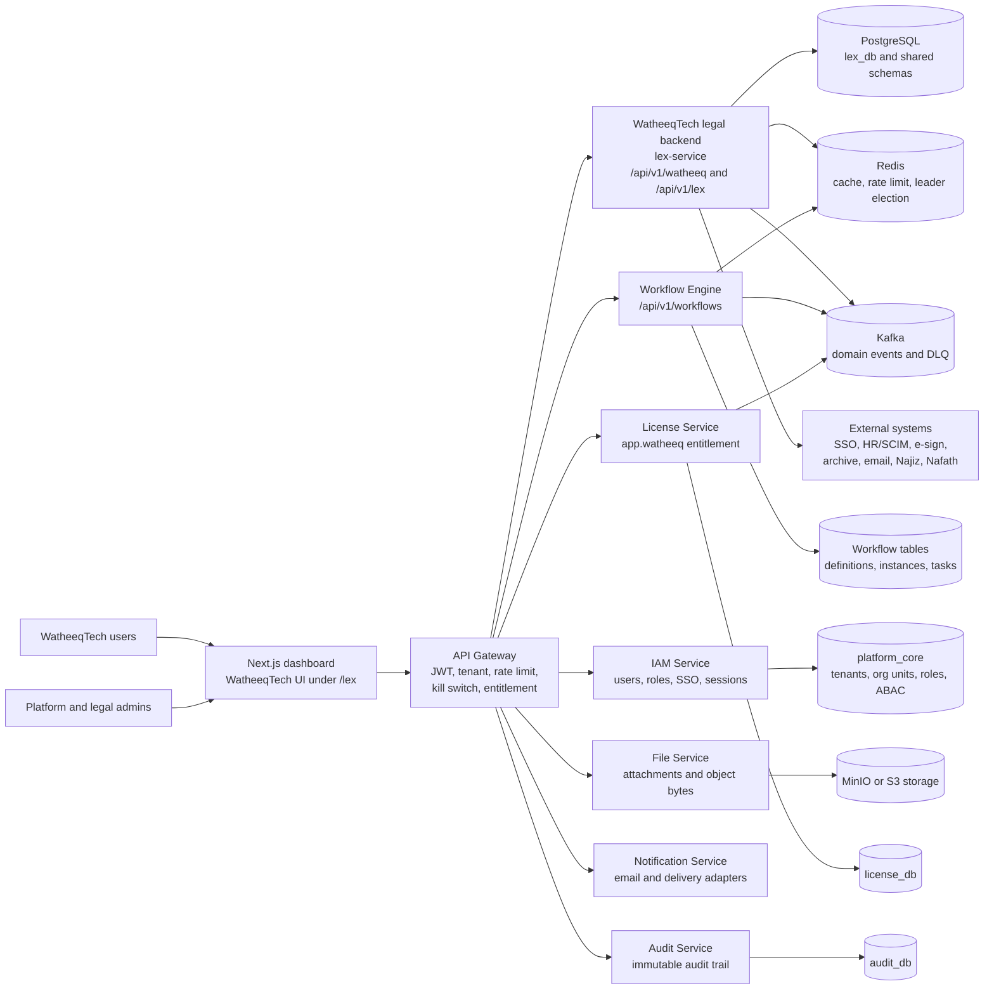
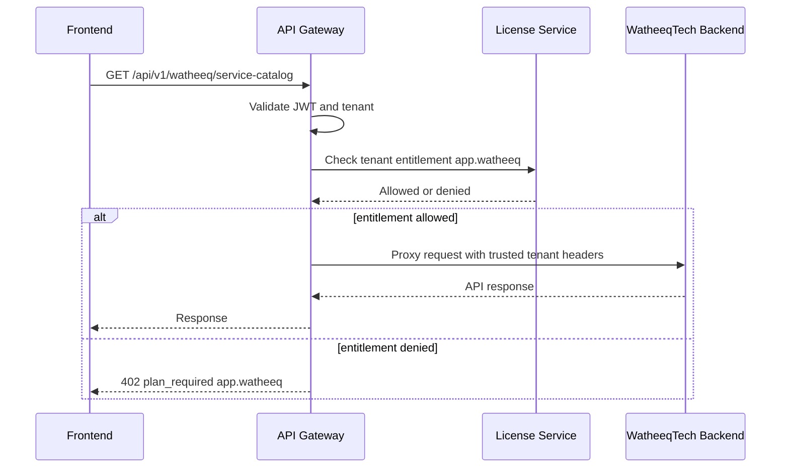
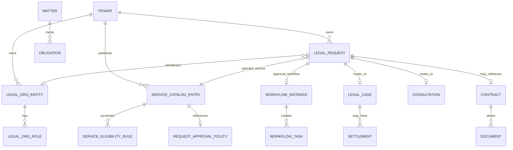
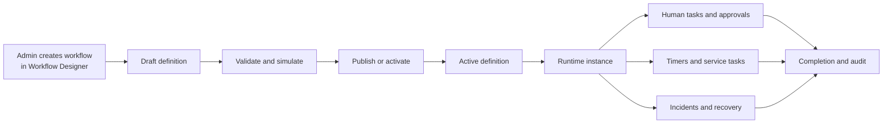
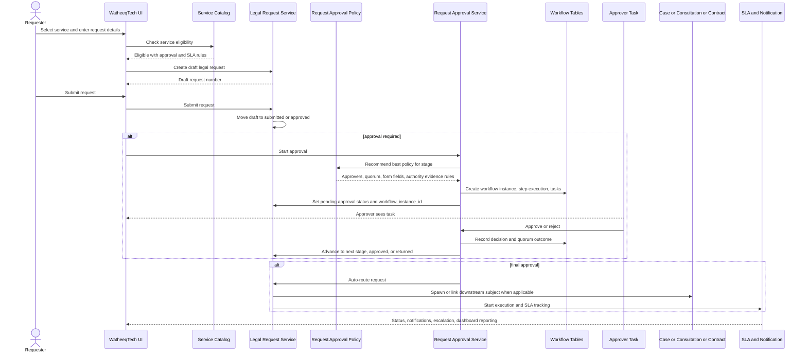
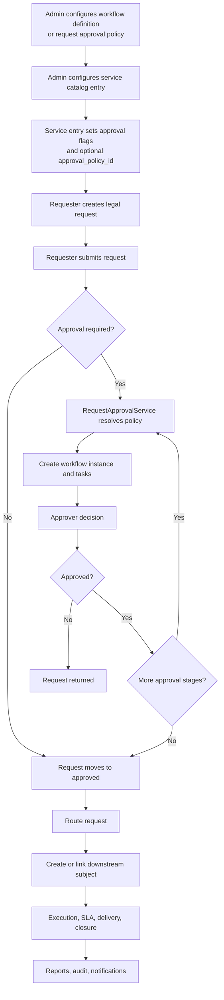

<!-- markdownlint-disable MD013 MD060 -->

# WatheeqTech Solution Architecture

Document date: 2026-07-12  
Audience: client stakeholders, solution architects, delivery leads, security reviewers, and implementation teams  
Scope: WatheeqTech Legal Affairs solution across frontend, backend, workflow, data, security, integration, deployment, and operations

## 1. Executive Summary

WatheeqTech is the Legal Affairs suite in the Clario360 platform. It provides a governed legal service desk, legal organization registry, workflow-driven request approvals, SLA tracking, cases, litigation, investigations, consultations, settlements, contracts, documents, signatures, reference libraries, legal holds, obligations, reporting, notifications, and integration management.

The implementation is a multi-service architecture:

- The user experience is delivered through the shared Next.js platform shell, with the WatheeqTech suite rendered under the current `/lex` route family.
- The API gateway protects suite APIs with authentication, tenant context, rate limits, kill switches, and the `app.watheeq` license entitlement.
- The WatheeqTech legal-affairs backend is the `lex-service` process. It exposes both `/api/v1/watheeq` and `/api/v1/lex` route prefixes to the same handlers.
- The shared workflow engine exposes `/api/v1/workflows` for workflow definitions, instances, tasks, templates, forms, SLA policies, substitutions, incidents, analytics, and process mining.
- WatheeqTech request approvals compose reusable workflow tables and approval-chain primitives with legal request approval policies.
- Platform services provide IAM, licensing, audit, notification, file storage, AI governance, eventing, Redis coordination, and Kafka-based cross-service event distribution.

Implementation namespace note: the client-facing product name is WatheeqTech. Some repository paths, route groups, comments, and migration names still use the legacy internal namespace `lex`. The gateway also exposes `/api/v1/watheeq` as the WatheeqTech API alias, and both `/api/v1/watheeq` and `/api/v1/lex` are gated by the `app.watheeq` entitlement.

## 2. Architecture Goals

The solution is designed around these goals:

- Provide a complete Legal Affairs operating model, not only contract management.
- Support business-user intake through a governed service catalog and reusable service request spine.
- Separate legal master data, role assignments, request approvals, SLA policy, and execution rules so each can evolve independently.
- Use durable workflow primitives for approval, tasking, simulation, escalation, and operational auditability.
- Enforce tenant isolation, least privilege, separation of duties, and auditability at API and data layers.
- Preserve Saudi/KSA operating requirements, including bilingual UX, RTL support, working calendars, legal-service SLA windows, and government-connector gating.
- Support SaaS tenant onboarding and WatheeqTech-only tenants with seeded legal roles and starter configuration.
- Keep external integrations honest: production-ready where self-serve providers are available, and sandbox or planned where government onboarding is required.

## 3. High-Level Logical Architecture

## 4. Main Runtime Components

| Component | Runtime role | Key responsibilities |
|---|---|---|
| Frontend dashboard | Next.js application | WatheeqTech navigation, legal service desk, admin consoles, workflow designer, persona UX, RTL/bilingual rendering, API client calls |
| API Gateway | Edge API proxy | Auth validation, tenant injection, entitlement checks, rate limiting, kill switches, headers, metrics, route contract metadata |
| WatheeqTech legal backend | `cmd/lex-service` | Legal domain APIs, service catalog, request spine, approvals, cases, contracts, documents, integrations, notifications, reporting |
| Workflow Engine | `cmd/workflow-engine` | Workflow definitions, designer APIs, instances, tasks, timers, SLA policies, forms, incident recovery, templates, analytics |
| IAM and platform core | Platform identity layer | Users, tenant roles, platform org-units, SSO, ABAC policies, AI governance credentials, persona source data |
| License Service | Entitlement decision layer | `app.watheeq` checks, plan entitlements, overrides, usage, offline licenses, entitlement-change events |
| Audit Service | Compliance evidence layer | Immutable audit records for material events and administrative actions |
| File Service and object store | Document byte layer | Attachment storage, reference library bytes, WORM/archive paths, object metadata |
| Notification Service | Communication layer | Email dispatch, notification provider integration, in-app notification support |
| Kafka and outbox | Event backbone | Cross-suite events, audit/event outbox relay, DLQ tracking, cache invalidation |
| Redis | Coordination layer | Gateway cache, rate limits, leader election, workflow timers/event waits, short-lived coordination |

## 5. Gateway and Entitlement Architecture

The API gateway is the enforcement point before requests reach WatheeqTech services.

Key behaviors:

- `/api/v1/watheeq` routes to `lex-service` and requires `app.watheeq`.
- `/api/v1/lex` also routes to `lex-service` and requires `app.watheeq`.
- The gateway validates JWTs, injects trusted headers, enforces read-only impersonation, applies route kill switches, records metrics, and performs rate limiting.
- Entitlement decisions are resolved through the license service and cached in Redis.
- License `entitlements_changed` events invalidate gateway entitlement cache entries.
- In protected environments, entitlement enforcement is fail-closed.

## 6. Frontend Architecture

WatheeqTech is delivered inside the shared dashboard shell. The current frontend route family is `frontend/src/app/(dashboard)/lex`, while the visible suite label is WatheeqTech.

Main UX areas:

- Overview and persona landing.
- Legal Service Desk: My Requests, New Request, intake, SLA board, request notifications.
- Cases and Investigations: litigation cases, investigations, settlements and ADR, case timeline.
- Contracts and Consultations: contracts, AI drafting, signatures, consultations, clause library, playbooks.
- Documents and Reference Library.
- Reports, analytics, and KPIs.
- Legal Affairs Administration: working calendars, service catalog, SLA targets, attachment policies, org registry, integrations, dead-letter queues, observability, pending changes, case classifications, workflow policies.
- Shared Workflow Administration: workflow definitions, designer, instances, tasks, forms, templates, analytics, incidents, and operations under `/admin/workflows`.

Important frontend architecture points:

- The WatheeqTech suite uses the shared dashboard layout, breadcrumb system, sidebar, command palette, auth store, and locale provider.
- `GET /api/v1/lex/me` hydrates the active legal persona, available legal roles, effective granular permissions, capabilities, and persona landing.
- The frontend merges WatheeqTech persona permissions into the auth store as an additive permission source.
- Sidebar items use granular `lex:<domain>:<verb>` permissions rather than only broad `lex:read` or `lex:write`.
- The suite supports RTL direction from the active locale.
- The WatheeqTech favicon and navigation presentation are activated when the user is inside the WatheeqTech route family or when the tenant only has WatheeqTech access.

## 7. Backend Legal-Affairs Architecture

The legal backend follows a conventional layered structure:

- `handler`: HTTP handlers and route registration.
- `dto`: request and response contracts.
- `service`: business workflows, orchestration, validation, events, domain state transitions.
- `repository`: database access and persistence rules.
- `model`: domain models and enums.
- `middleware`: tenant, RBAC, ABAC, org-RBAC, dynamic separation-of-duties, webhook rate limits.
- `calendar`: working-time calculator.
- `crypto`: field encryption and approval authority evidence validation.
- `integration`: connector framework and integration governance services.
- `monitor`: background jobs and cross-tenant scheduled sweeps.
- `seeder`: starter data and legal role seeds.

Core service composition includes:

- Working calendar service.
- Legal organization registry service.
- Legal request service and canonical request spine.
- Request approval policy service.
- Request approval service.
- Service catalog and intake service.
- SLA service, escalation service, execution rules, and delivery confirmation.
- Legal case, litigation, investigation, consultation, case timeline, and settlement services.
- Contract, contract review desk, document, document editor, clause library, reference library, drafting, compliance, obligations, legal hold, signature, and matter services.
- Reporting, notifications, attachment policy, saved views, integration registry, integration resilience, integration governance, integration observability, SSO, and persona services.

## 8. Domain Capability Architecture

| Domain | Architecture responsibility |
|---|---|
| Service Catalog | Publishes legal services, channel rules, eligibility rules, approval flags, optional approval policy, SLA metadata |
| Legal Request Spine | Canonical lifecycle row for all legal service requests and downstream subject linkage |
| Request Approval | Two-stage requester-to-provider approval orchestration using reusable workflow task primitives |
| Organization Registry | Legal org hierarchy, role bindings, escalation recipients, platform org-unit mapping, org-scoped RBAC prerequisites |
| Working Calendar | Tenant-specific working days, Ramadan/holiday support, working-time calculations, SLA due dates |
| SLA and Escalation | Acknowledgement deadlines, breach detection, L1/L2/L3 escalation, outbox notifications |
| Execution Rules | Completeness checks, requirement items, substantial-change detection, delivery confirmation |
| Cases and Litigation | Case intake, classification, plaintiff/defendant flows, pleadings, hearings, judgments, experts |
| Investigations | Violation/misconduct studies, approval sign-off, evidence and lifecycle tracking |
| Consultations | Legal opinion and advisory request handling, approval and response workflows |
| Settlements and ADR | Negotiation rounds, settlement documents, approval, duration facts, ADR reporting |
| Contracts | Contract lifecycle, review desk, final versions, categories, compliance, clause amendments, comments, archive |
| Documents | Document repository, versioning, editor workspace, approval matrix, guest portal, search |
| AI Drafting | Governed drafting studio, prompt templates, deterministic analysis with optional LLM enrichment |
| Knowledge Libraries | Clause library, regulation library, reference library, playbooks, AI Q&A and feedback |
| Signatures | Signature envelopes, custody, provider callbacks, locale handling, provider dispatch |
| Legal Hold and Obligations | Matter/document preservation and obligation extraction/reminder planning |
| Reporting | KPI rollups, SLA compliance, duration facts, analytics, dashboards |
| Integrations | Connector catalog, schemas, health, test, sync, DLQ, reconciliation, change governance, egress controls |

## 9. Data Architecture

WatheeqTech is tenant-scoped. Most domain tables carry `tenant_id` and are accessed through tenant-aware services and repositories.

Primary data stores:

- `lex_db`: WatheeqTech legal domain data and embedded workflow tables used by legal approval orchestration.
- Workflow database or schema: workflow definitions, instances, tasks, timers, incidents, templates, forms, SLA policies, calendars, marketplace entries, trigger executions, activity idempotency, and event outbox.
- `platform_core`: tenants, platform org-units, IAM role records, ABAC policies, SSO connections, AI governance and tenant LLM credential metadata.
- `license_db`: plans, entitlements, tenant licenses, overrides, offline license state, usage.
- `audit_db`: immutable audit trail and material governance events.
- Notification database: in-app and outbound notification state where configured.
- Object storage: MinIO or S3-compatible storage for attachments, reference library bytes, archive objects, and WORM paths.
- Redis: transient coordination, rate limiting, leadership, event waits, and cache.
- Kafka: asynchronous domain events, DLQ flows, cross-suite consumers, cache invalidation.

### Important Data Model Relationships

### Data Governance and Retention

The solution uses several governance patterns:

- Tenant-leading keys and row-level security for core legal tables.
- Soft-delete where domain auditability requires retaining records.
- Append-only audit rows for approval policies, request status changes, and material lifecycle events.
- Immutable snapshots for approval policy versions.
- Workflow activity idempotency ledgers for outbound activity attempts.
- Dead-letter queues for failed integration events and workflow incidents.
- Encrypted integration secrets and selected sensitive fields.
- Optional WORM/object-lock archive paths.

## 10. Workflow Architecture

WatheeqTech uses workflow in two related ways.

First, there is the shared workflow engine and designer. This is the platform workflow capability. It allows admins to create, edit, simulate, publish, version, promote, import/export BPMN, and operate workflow definitions.

Second, WatheeqTech request approvals use legal request approval policies. Those policies resolve approvers and approval-chain behavior for legal requests. When a request is submitted, the request approval service creates workflow instances, step executions, and workflow tasks using the shared workflow primitives.

### Workflow Designer Capabilities

The designer supports:

- Draft workflow definitions.
- Trigger configuration: manual, event, and schedule triggers.
- Variables and sensitivity classification.
- Human tasks and form schemas.
- Approval-chain editing.
- Service tasks, timers, conditions, parallel paths, event gateways, call activities, and multi-instance patterns.
- Simulation with mock decisions and SLA projection.
- Version browsing and promotion.
- BPMN import and export.

### Workflow Runtime Capabilities

The workflow engine supports:

- Durable definitions and instances.
- Human tasks, claim/unclaim, complete, reject, assign, delegate, and comments.
- Candidate groups and candidate users.
- SLA deadlines and at-risk markers.
- Timers, cron triggers, event waits, and trigger execution replay.
- Activity idempotency for outbound service-task effects.
- Incidents, retry, skip, modify-retry, abandon, overrides, and dead-letter.
- Out-of-office substitutions.
- Forms and business calendars.
- Templates and marketplace installs.
- Analytics, cycle time, bottlenecks, rework, throughput, variants, conformance, and process map views.

## 11. WatheeqTech Request and Approval Flow

The legal request flow is built on a canonical request spine.

Service catalog entries define:

- Service code.
- Request type.
- Bilingual name and description.
- Available audience.
- Eligibility rules.
- Intake channel.
- Requester approval requirement.
- Provider approval requirement.
- Optional approval policy ID.
- SLA metadata.

Seeded services include:

- Legal Consultation.
- Contract and Agreement Review.
- Preliminary Legal Study.
- Litigation Case Study and Filing.
- Enforcement Request.
- Violation or Misconduct Study.
- Field Inspection and Incident Documentation.
- Issuance of Powers of Attorney or Authorizations.

### Request Lifecycle

The canonical request statuses are:

- `draft`
- `submitted`
- `pending_requester_approval`
- `pending_provider_approval`
- `approved`
- `routed`
- `in_execution`
- `delivered`
- `closed`
- `returned`
- `cancelled`

### End-to-End Request Approval Sequence

### How Workflows Link to Services

There are two linkage models:

- Generic platform workflows are created in the Workflow Designer and executed through `/api/v1/workflows`.
- WatheeqTech legal service requests use request approval policies, which can be attached to service catalog entries through `approval_policy_id`.

When a request is submitted:

1. The service catalog controls whether requester and provider approvals are required.
2. The request approval service resolves the best active request approval policy for the request type, service, stage, department, priority, and value range.
3. A workflow instance is created and linked to `legal_requests.workflow_instance_id`.
4. Approval tasks are created in `workflow_tasks`.
5. Decision routes enforce the required legal approval permissions and separation-of-duties rules.
6. The request moves through requester approval, provider approval, approved, routed, execution, delivery, and closure.

## 12. Organization Registry and Role Architecture

The legal organization registry is the master data backbone for WatheeqTech.

It supports:

- Company, business unit, shared services unit, department, and section entity types.
- Parent-child hierarchy with materialized path.
- Optional platform org-unit UUID mapping.
- Bilingual names.
- Active/inactive state.
- Metadata attributes.
- Role bindings for escalation and legal responsibility.

Key organization role bindings include:

- Section supervisor.
- Department manager.
- Shared services manager.
- Legal director.
- Contracts manager.
- Compliance officer.
- General counsel.

The registry feeds:

- SLA escalation recipients.
- Service eligibility.
- Addressable distribution targets.
- Org-scoped RBAC prerequisites.
- Platform org-unit reconciliation.

Org-scoped RBAC uses five verbs:

- `view`
- `add`
- `edit`
- `approve`
- `close`

## 13. RBAC, Persona, and Authorization Architecture

WatheeqTech uses several authorization layers:

- JWT-based authentication from IAM.
- Gateway route-level entitlement check for `app.watheeq`.
- Coarse suite permissions such as `lex:read` and `lex:write` for compatibility.
- Granular legal permissions such as `lex:case:view`, `lex:case:approve`, `lex:integration:manage`, and `lex:report:read`.
- Active legal persona selected through `/api/v1/lex/me` and `/api/v1/lex/persona`.
- Backend route guards using required permission or any-of permission checks.
- ABAC policy enforcement backed by `platform_core` when configured.
- Org-RBAC checks against legal org-entity role prerequisites.
- Dynamic separation-of-duties checks that prevent authors or prior approvers from approving or closing their own records.

Important enforcement principles:

- Backend authorization is the security boundary.
- Frontend persona and sidebar permission logic are usability and navigation controls.
- Approval decision routes avoid broad write fallbacks where the action is an approval verdict.
- Dynamic separation of duties has no admin bypass.
- Misconfigured SoD resolvers fail closed.

## 14. Security Architecture

Security controls include:

- Authentication: JWT validation through gateway and service middleware.
- Tenant isolation: tenant context propagated through gateway and tenant guard.
- Entitlement: `app.watheeq` checked before reaching the WatheeqTech backend.
- RBAC: granular legal permission slugs and 14 named legal roles seeded into `platform_core`.
- ABAC: optional attribute-policy enforcement using platform policies.
- Org-RBAC: legal org-role prerequisites layered onto destructive, edit, approve, and close actions.
- Separation of duties: author and prior-approver checks on approvals and closures.
- Field encryption: AES-256-GCM modes for sensitive contract fields; non-dev profiles fail fast if encryption is disabled.
- Workflow payload protection: classified workflow variables and form fields can be stored with encrypted envelopes.
- Integration secret custody: connector config secrets are encrypted and redacted in API responses.
- Approval authority evidence: optional trusted root CA bundle and revocation list for DoA evidence validation.
- Rate limiting: gateway and webhook rate limiting.
- Webhook controls: provider-specific webhook routes and rate limits.
- Data residency: service-region enforcement middleware when configured.
- Audit: append-only policy/request audit rows and immutable audit-service relays for material events.
- Operational kill switches: route, service, tenant, and entitlement kill scopes at gateway.

## 15. Integration Architecture

WatheeqTech has a connector framework centered on integration endpoints and optional adapter capabilities.

Adapter capabilities:

- `Probe`: readiness and health signal.
- `TestConnection`: non-mutating provider reachability and auth check.
- `Sync`: pull data from external systems in full or delta mode.
- `Invoke`: execute provider actions such as dispatch or archive.

Supported connector families:

- Generic OIDC/SAML SSO.
- HR and identity: SCIM, HRIS, CSV/SFTP, LDAP patterns.
- E-archiving: CMIS, S3 object-lock, SharePoint-style archive targets.
- E-signature: DocuSign, Adobe, native provider paths, and regional provider records.
- Email: inbound intake and outbound dispatcher integration.
- Internal REST or webhook connector.
- Najiz court portal: government-gated, sandbox/mock until Takamul onboarding.
- Nafath identity confirmation: government-gated; identity confirmation is separate from legally binding signature.

Integration governance includes:

- Dynamic connector schemas for admin UI rendering.
- Secret redaction and merge-on-update behavior.
- Connection testing.
- Sync preview.
- Sync run ledger.
- Dead-letter queues.
- Reconciliation comparisons.
- Conflict tracking.
- Pending change gate with propose, approve, and reject.
- Egress policy.
- Breaker reset and health dashboards.
- Scheduled sync monitor.
- Scheduled secret rotation monitor.

## 16. AI, Drafting, and Knowledge Architecture

WatheeqTech includes governed AI and knowledge capabilities:

- Deterministic analyzer baseline for clauses and obligations.
- Optional LLM enrichment enabled by configuration and tenant AI governance.
- Per-tenant LLM credentials stored through platform-core governance.
- Drafting studio and prompt templates.
- Draft review and approval-oriented routing.
- Clause library and regulation library.
- Reference library with PDF corpus support.
- Reference AI search, ask, stream, and feedback endpoints.
- Playbooks and clause deviation review.

The AI path is designed to fail safely:

- Deterministic analysis remains the baseline.
- LLM enrichment is off by default.
- Tenant entitlement and AI governance determine whether enrichment is active.
- Reference library storage can run from a local read-only volume or production file-service backed storage.

## 17. Notifications, SLA, and Background Processing

WatheeqTech uses synchronous API writes plus background monitors.

Legal backend background jobs include:

- Contract expiry monitor.
- Compliance monitor.
- Renewal reminder.
- SLA monitor for due acknowledgements, breaches, and escalations.
- Delivery auto-close monitor.
- Proximity monitor for upcoming hearings and reminders.
- Integration sync monitor.
- Integration secret rotation monitor.
- Outbox dispatcher for SLA and obligation notifications.

Workflow engine background jobs include:

- Recovery service.
- Timer and scheduler service.
- Event wait consumer.
- Trigger consumer.
- Cron trigger scheduler.
- Activity idempotency reconciler.
- SLA dispatch and reminder processing.

Leader election is used for mutating integration schedulers so multiple replicas do not concurrently perform the same provider sync or secret rotation.

## 18. Observability and Operations

Operational architecture includes:

- `/healthz` liveness endpoints.
- `/readyz` readiness endpoints.
- Prometheus metrics endpoints.
- OpenTelemetry tracing when configured.
- Structured logs with service name and component context.
- Gateway metrics for proxy, entitlement, rate limit, and upstream behavior.
- Integration health dashboards and sync/test ledgers.
- Workflow analytics, incident queues, dead-letter views, and process mining.
- Grafana dashboards under deployment assets.
- Kafka DLQ tracking and admin counts.
- Append-only audit logs and immutable audit-service relay for material governance events.

## 19. Deployment Architecture

WatheeqTech is deployable through Helm and local Docker-based infrastructure.

Kubernetes deployment shape:

- `frontend`: Next.js user interface.
- `api-gateway`: public API entry point and reverse proxy.
- `lex-service`: WatheeqTech legal backend, default ports 8087 and 9087.
- `workflow-engine`: shared workflow runtime, default ports 8085 and 9085.
- `iam-service`: identity and access management.
- `license-service`: plan and entitlement decisions.
- `audit-service`: immutable audit trail.
- `file-service`: document and object byte mediation.
- `notification-service`: outbound notification adapters.
- PostgreSQL, Redis, Kafka, MinIO/S3, Prometheus, and Grafana.

Helm templates provide:

- Deployments.
- Services.
- ConfigMaps.
- Secrets.
- HPAs where configured.
- Pod disruption budgets.
- Topology spread constraints.
- Prometheus annotations and monitoring resources.
- Migration and seed jobs.
- Environment-specific values for staging, production, regulated, and air-gapped deployments.

WatheeqTech deployment knobs include:

- `LEX_DB_URL`
- `LEX_REDIS_ADDR`
- `LEX_KAFKA_BROKERS`
- `LEX_HTTP_PORT`
- `LEX_ADMIN_PORT`
- `LEX_SEED_DEMO_DATA`
- `LEX_ORG_JURISDICTION`
- `LEX_SLA_MONITOR_INTERVAL`
- `LEX_OUTBOX_DISPATCH_INTERVAL`
- `LEX_INTEGRATION_SYNC_INTERVAL`
- `LEX_INTEGRATION_ROTATION_INTERVAL`
- `LEX_LLM_ENRICHMENT_ENABLED`
- `LEX_CONTRACT_FIELD_ENCRYPTION_MODE`
- `LEX_APPROVAL_AUTHORITY_TRUSTED_ROOTS_PEM` or file path
- `LEX_SIGNATURE_PROVIDER_MODE`
- `LEX_LEX_NOTIFICATION_PROVIDER_MODE`
- `LEX_REFERENCE_LIBRARY_DIR` or file-service configuration

## 20. Tenant Onboarding and Provisioning

WatheeqTech tenant provisioning is driven by the onboarding service and the internal legal-affairs provision hook.

End-to-end onboarding behavior:

1. The customer selects WatheeqTech in the onboarding wizard.
2. Licensing assigns the plan and entitlements, including `app.watheeq`.
3. The onboarding provisioner calls the WatheeqTech internal provisioning endpoint when the suite is selected.
4. The provisioning endpoint applies the Legal Affairs starter template.
5. The template seeds legal org registry scaffolding, service catalog, SLA settings, escalation configuration, working calendar, request approval templates, and legal roles.
6. When platform core is available, the tenant admin receives the legal system administrator role.

The internal provisioning endpoint is service-token guarded:

- `POST /internal/lex/provision`
- Payload includes `tenant_id`, optional `admin_user_id`, and `include_sample_data`.

The endpoint name still uses the internal namespace, but the provisioning step is explicitly "Provision Watheeq Legal Affairs" in the onboarding flow.

## 21. Request-to-Workflow-to-Service Reference Flow

This is the operational chain that explains how a request triggers approval workflow and then drives service execution.

## 22. Non-Functional Architecture

### Availability

- Stateless service replicas for gateway, legal backend, workflow engine, frontend, and supporting services.
- Rolling update strategy with zero unavailable pods where configured.
- Pod disruption budgets and topology spread constraints.
- Leader election for mutating schedulers.

### Reliability

- Transactional writes for status transitions and audit rows.
- Workflow lock versioning and idempotency ledgers.
- Event outbox and DLQ handling.
- Retry and incident handling for workflow step failures.
- Integration sync ledgers and dead-letter queues.

### Scalability

- Horizontal service replicas.
- Database indexes for tenant, status, definition, workflow, task, and analytics queries.
- Redis for transient coordination and cache.
- Kafka for asynchronous event distribution.
- Separate background monitors to avoid blocking request paths.

### Performance

- Dashboard cache TTL for WatheeqTech dashboard summaries.
- Rate limiting at gateway and suite levels.
- Indexes for workflow analytics, legal request filters, task queues, and integration ledgers.
- Reference library byte path can be local volume for fast out-of-box install or file-service backed for production.

### Localization

- Bilingual fields for legal service catalog, org entity names, roles, and templates.
- RTL-safe frontend layout.
- KSA helper modules for Hijri, holidays, numerals, and currency.
- Working calendar model supports tenant-specific holidays and working-time rules.

### Compliance

- Tenant isolation and license gating.
- Immutable and append-only audit patterns.
- Dynamic separation of duties.
- Approval authority evidence.
- Field encryption and secrets redaction.
- Data residency middleware.
- WORM/archive integration path.

## 23. Current Implementation Boundaries and Known Gated Areas

The architecture is broad and implemented across many modules, but a few areas are intentionally gated or environment-dependent:

- Najiz and Nafath are government-gated and require tenant/provider onboarding before live production use.
- Some public documents and code comments still use the legacy internal namespace `lex`; client-facing documents should use WatheeqTech.
- The shared workflow designer and the WatheeqTech request approval policy console are related but not identical. Generic workflows live under `/api/v1/workflows`; legal service request approval policies live under the WatheeqTech legal backend.
- Production encryption requires configured keys. Non-development profiles fail fast when sensitive field encryption would be disabled.
- Integration providers that require external credentials remain in planned, sandbox, or disabled state until credentials and provider contracts are configured.
- Standalone workflow-engine tables enforce RLS through versioned migrations. Embedded workflow tables used directly by suites are tenant-led and service-controlled; full force-RLS for embedded direct SQL paths should remain an architecture hardening item.

## 24. Source Traceability

This architecture was researched from the local WatheeqTech and platform implementation, including:

- `backend/cmd/lex-service/main.go`
- `backend/internal/lex/app.go`
- `backend/internal/lex/config/config.go`
- `backend/internal/lex/handler/routes.go`
- `backend/internal/lex/model/legal_request.go`
- `backend/internal/lex/model/service_catalog.go`
- `backend/internal/lex/model/request_approval_policy.go`
- `backend/internal/lex/model/org_entity.go`
- `backend/internal/lex/service/legal_request_service.go`
- `backend/internal/lex/service/request_approval_service.go`
- `backend/internal/workflow/model/definition.go`
- `backend/internal/workflow/model/instance.go`
- `backend/internal/workflow/repository/schema.go`
- `backend/cmd/workflow-engine/main.go`
- `backend/cmd/workflow-engine/rbac.go`
- `backend/internal/gateway/config/routes.go`
- `backend/cmd/api-gateway/main.go`
- `backend/internal/onboarding/service/provisioner.go`
- `backend/internal/onboarding/service/lex_provision_client.go`
- `backend/internal/license/service/service.go`
- `frontend/src/app/(dashboard)/lex`
- `frontend/src/app/(dashboard)/admin/workflows`
- `frontend/src/config/navigation.ts`
- `frontend/src/lib/lex/me.ts`
- `docs/client_requirement_must/Lex_Watheeq_Capabilities_Inventory.md`
- `docs/ClarioWatheeq/Lex_BuildOut_Proposal.md`
- `docs/ClarioWatheeq/Lex_Only_Tenant_Onboarding_Design.md`
- `docs/ClarioWatheeq/Lex_Integration_Platform_Design.md`
- `docs/api/watheeq-lex-service.openapi.yaml`
- `deploy/helm/clario360/templates/lex-service`
- `deploy/helm/clario360/templates/workflow-engine`
- `deploy/helm/clario360`
